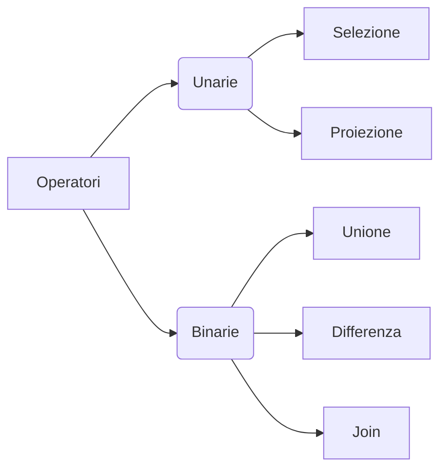

È composta da un insieme minimo di *cinque operatori* che danno l'intero potere espressivo del linguaggio.

### Selezione ($\sigma$)
```sql
SELECT [PredSel] TABELLA
```
È una tabella (priva di nome) con:
- Schema: lo stesso schema di `TABELLA`.
- Istanza: le tuple di 'TABELLA' che soddisfano il predicato di selezione 'PredSel'.
Esempio: 
```sql
SELECT [NOME='Paola'] STUDENTE
```

### Proiezione ($\pi$ )
```sql
PROJECT [attributiProiez] TABELLA
```
È una tabella (priva di nome) con:
- Schema: gli attributi 'attributiProiez'.
- Istanza: la restrizione delle tuple sugli attributi 'attributiProiez'.
Esempio:
```sql
PROJECT [NOME,C-DIP] STUDENTE
```

### Assegnamento (=)
Serve per dare un nome al risultato di una espressione algebrica.
Non fa parte delle operazioni algebriche.
```sql
INFORMATICI = SELECT [C-DIP='Inf'] STUDENTI
```

### Unione ($\cup$ )
```sql
TABELLA1 UNION TABELLA2
```
Si può fare se TABELLA1 e TABELLA2 sono compatibili (con domini ordinatamente dello stesso tipo).
È una tabella (priva di nome) con:
- Schema: lo schema di TABELLA1.
- Istanza: l'unione delle tuple di TABELLA1 e TABELLA2.
L'unione e' commutativa, associativa.
Esempio:
```sql
INFORMATICI UNION TORINESI
```

### Differenza (-)
```sql
TABELLA1 MINUS TABELLA2
```
Si può fare se TABELLA1 e TABELLA2 sono compatibili.
È una tabella (priva di nome) con:
- Schema: lo schema di TABELLA1.
- Istanza: la differenza delle tuple di TABELLA1 e TABELLA2.

### Join ($\bowtie$)
```sql
TABELLA1 JOIN [PredJoin] TABELLA2
```
È una tabella (priva di nome) con:
- Schema: la concatenazione degli schemi di TABELLA1 e TABELLA2.
- Istanza: le tuple ottenute concatenando quelle di TABELLA1 e di TABELLA2 che soddisfano il predicato 'PredJoin'.
Esempio:
```sql
STUDENTE JOIN [MATR=MATR] ESAME
```
Esistono due tipi di join:
- *Equi-join*: soli confronti di uguaglianza.
- *Join naturale*: equi-join di tutti gli attributi omonimi.
